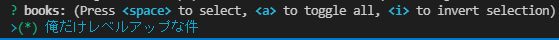
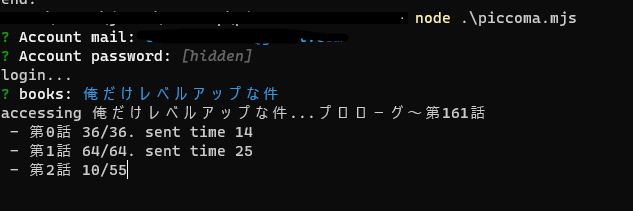

# Piccoma-downloader
Download manga from [Piccoma](https://piccoma.com/)

## Basic Usage
Make sure you have a [node.js](https://nodejs.org/) environment
1. Clone or download this repository
2. Run `npm install`
3. Run `node piccoma.mjs`
4. Enter your mail and password
5. Select mangas from the bookmarks list (all books are selected by default).


6. Wait for the download to finish.

- compress downloaded mangas into zip

```
node archive.mjs 
```

## Options

Examples:  
```
node piccoma.mjs --config config.json
``` 
```
node piccoma.mjs --mail user@example.com --password mypassword --all
``` 
```
node piccoma.mjs --sessionid <mysessionId>
``` 

#### `-h, --help`  
Display help message
#### `--mail`
Account mail
#### `--password`
Account password
#### `--sessionid`
Session id of your piccoma login. For accounts that do not support email address login. 
#### `--all`
Download all mangas in bookmarks. If not specified, the selection cli will be displayed.
#### `--manga`
`chapter` or `volume` for manga (default: volume)
#### `--webtoon`
`chapter` or `volume` for webtoon (default: chapter)
#### `--timeout`
Maximum navigation time in milliseconds. If `0`, the timeout becomes infinite. (default: 30000ms)
#### `--config`
Path of config file. You can set the cli options in config file. Here's a [sample](https://github.com/Elastic1/piccoma-downloader/blob/main/config.json)

